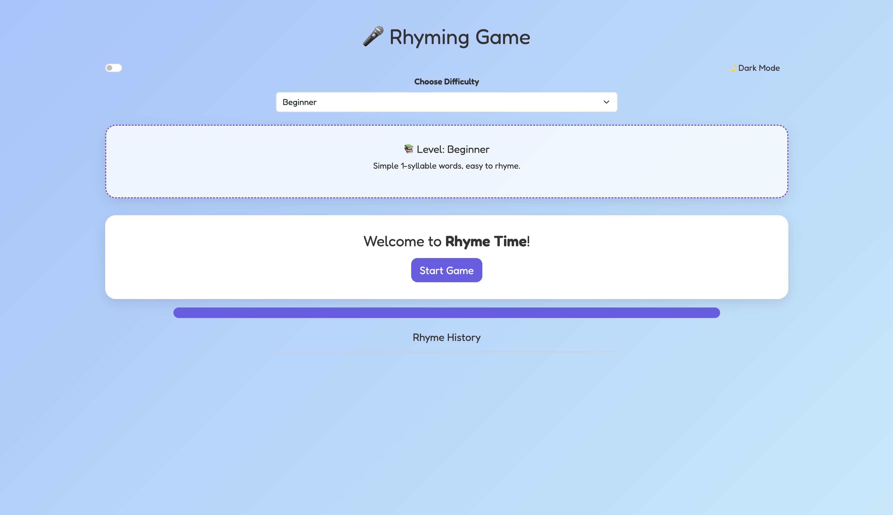
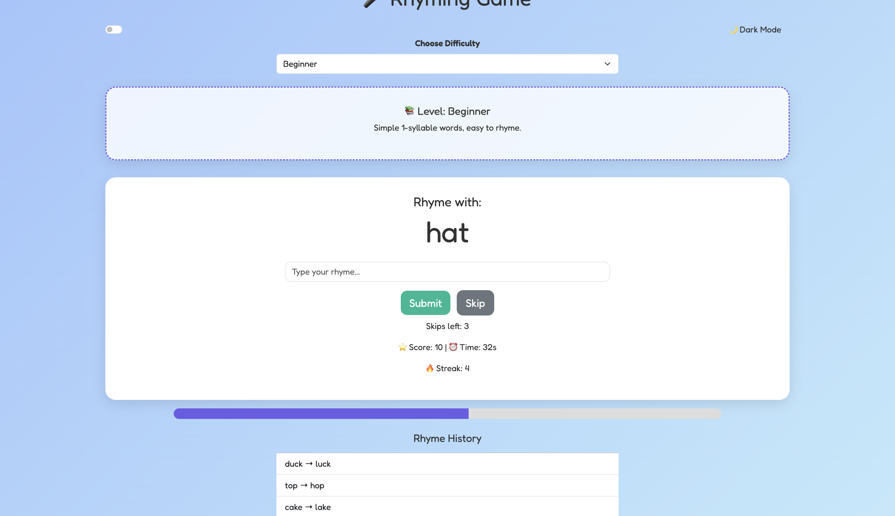
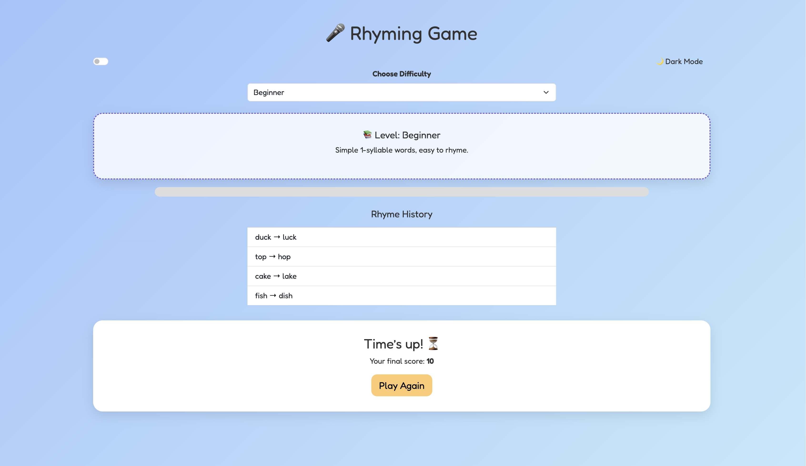

# Rhyme Time – A JavaScript Rhyming Game

**Rhyme Time** is a fun and challenging browser game where players test their rhyming skills across six difficulty levels. The game uses the [Datamuse API](https://www.datamuse.com/api/) to ensure rhymes are valid based on sound, not just spelling.

---

## 🚀 Features

- 🎚️ **Difficulty Levels**: From Beginner to Master, each with 25 unique, rhyme-safe words.
- ⏱ **Countdown Timer**: Beat the clock with a 60-second time limit.
- 🧠 **Real-Time Rhyme Checking**: Validated via Datamuse’s phonetic rhyming API.
- 🔥 **Streak Scoring**: Earn combo points for consecutive correct rhymes.
- ⏭️ **Skip Button**: Skip up to 3 tough words per game.
- 📜 **Rhyme History Log**: Track your correct rhymes as you play.
- 🌗 **Light/Dark Mode Toggle**: Switch between light and dark themes.
- 📊 **Visual Timer Bar**: Animated countdown bar to keep the pressure on.
- 🎨 **Responsive UI**: Designed with Bootstrap 5 and mobile-first styling.

---

## 🎮 How to Play

1. Select your **difficulty level** from the dropdown.
2. Click **Start Game** to begin.
3. A word appears — type a rhyming word and hit **Submit**.
4. If correct, earn points and advance. Wrong answers reset your streak.
5. You can **skip** up to 3 words per round.
6. When time runs out, your **final score** is shown.
7. Click **Play Again** to reset and try a new round.

---

## 🛠 Built With

- HTML5, CSS3, JavaScript (Vanilla)
- Bootstrap 5
- Google Fonts – `Fredoka`
- [Datamuse API](https://www.datamuse.com/api/)

---

## 📷 Screenshots

## 📁 Project Structure
.
rhyme-time/
├── index.html
├── README.md
├── assets/
│   ├── css/
│   │   └── style.css
│   ├── js/
│   │   └── script.js
│   └── screenshots/
│       ├── welcome.png
│       ├── game.png
│       └── end.png

## 📦 Deployment

This project is deployed using GitHub Pages.

---

## 👉 View Live Demo

(https://dutchborn.github.io/Rhyme-time/)

---

## 🎯 Learning Objectives

Work with the fetch() API for live data

DOM manipulation and event handling

Responsive design using Bootstrap

Game logic: scoring, timing, difficulty levels

UX polish: animations, accessibility, layout

Error handling and user feedback

Managing real-world APIs (Datamuse)
---

## 👩‍💻 Author

[Lesley Asibey] – JavaScript Developer & Game Creator
Project submitted for coursework / portfolio showcase.

